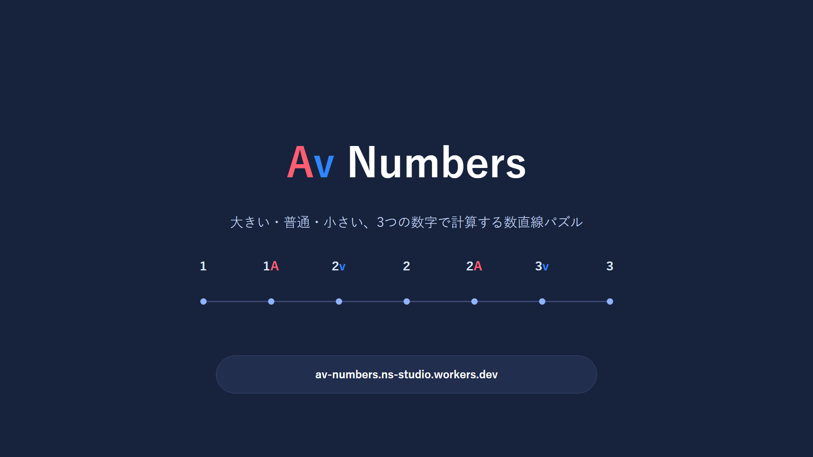
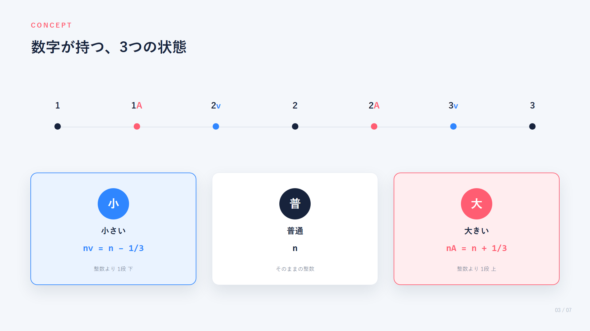
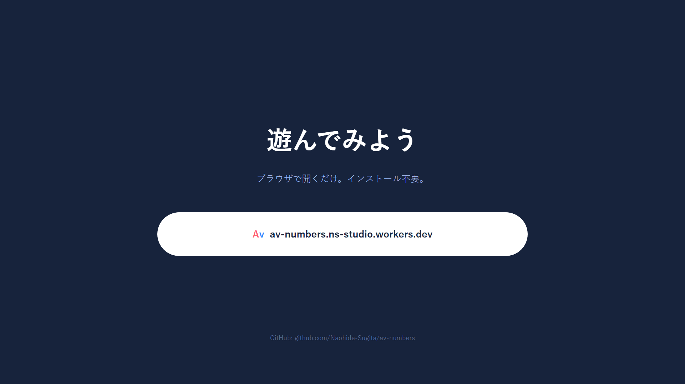

# AV Numbers

**▶ Play: [https://av-numbers.ns-studio.workers.dev](https://av-numbers.ns-studio.workers.dev)**　|　**📊 [コンセプト・ゲーム紹介スライド](#コンセプトゲーム紹介)**

すべての数が「小さい（`v`） / 普通 / 大きい（`A`）」の3状態を持ち、その状態が足し算・引き算の中で相殺・増幅・反転する、数直線パズル型の計算ゲーム。

```text
1 → 1A → 2v → 2 → 2A → 3v → 3
```

`2v + 3A = 5`（相殺）、`2A + 3A = 6v`（正規化）、`5 - 3v = 2A`（引き算での反転）のように、数字に付いた `v / A` の作用を1段（= 1/3）単位で合成しながら計算する。詳しい数理仕様は [docs/DESIGN.md](docs/DESIGN.md) を参照。

## コンセプト・ゲーム紹介








編集可能な元データ（PowerPoint）は [slides/AV_Numbers_concept.pptx](slides/AV_Numbers_concept.pptx)。

## 特徴

- 演算子は通常の `+ / -` のみ。状態を持つのは**数字だけ**
- 回答は「① 普通の数字だけで計算 → ② 状態分だけ `← / →` で移動」の2段階UI
- 1ステージ10問、8問以上正解でクリア。全3ステージ構成（Stage 1: 2項計算／Stage 2: 3項以上の複合／Stage 3: 逆算）で、新しい現象（移動・相殺・正規化・反転・複合・逆算）を段階的に学ぶ
- 不正解時は数直線アニメーションで、どの数字のどの状態がどちらへ何段作用したかを可視化

## デモを試す

**公開URL（Cloudflare Pages）**：https://av-numbers.ns-studio.workers.dev — ブラウザで開くだけで遊べる。

ローカルで動かす場合は、単一HTMLファイルのプロトタイプ（ビルド不要、外部依存なし）。

```bash
# ブラウザで直接開く
start AV_Numbers_prototype_v9.html
```

もしくはブラウザのファイルオープン（`Ctrl+O`）で `AV_Numbers_prototype_v9.html` を開く。進捗（解放ステージ・ベストスコア）は `localStorage` に保存される（`file://` で直接開くとブラウザによっては `localStorage` が無効化されるため、ローカルサーバー経由での起動を推奨。例：`python -m http.server` を実行し `http://localhost:8000/AV_Numbers_prototype_v9.html` を開く）。

旧バージョン（`AV_Numbers_prototype_v8.html`、旧8ステージ案・逆算未実装）は変更前の参考として残している。

## プロジェクト構成

```text
.
├── AV_Numbers_prototype_v9.html   # 現行プロトタイプ（Vanilla HTML/CSS/JS、単一ファイル）
├── AV_Numbers_prototype_v8.html   # 旧バージョン（参考・アーカイブ）
├── docs/
│   ├── DESIGN.md                  # 数理設計：着想の背景、v/A/無印の定義、足し算・引き算の合成規則
│   ├── GAME_DESIGN.md             # ゲーム設計：ステージ構成、出題ルール、回答UI、チュートリアル
│   ├── DEPLOYMENT.md              # 公開設計：Cloudflare Pagesでの公開方針
│   └── ANIMATION.md               # アニメーション強化設計
└── README.md
```

## ドキュメント

| ドキュメント | 内容 |
| --- | --- |
| [docs/DESIGN.md](docs/DESIGN.md) | ゲームの着想の背景、数字の3状態（`v / 無印 / A`）の定義、足し算・引き算における状態の合成・反転・正規化ルール |
| [docs/GAME_DESIGN.md](docs/GAME_DESIGN.md) | 全3ステージの構成、出題生成ルール、回答入力UI、正解/不正解時の演出、チュートリアル、ホーム/結果画面 |
| [docs/DEPLOYMENT.md](docs/DEPLOYMENT.md) | Cloudflare Pagesを使った公開方針、リポジトリ構成、デプロイ手順 |
| [docs/ANIMATION.md](docs/ANIMATION.md) | 数直線アニメーションを中心とした、アニメーション強化の設計 |

## 現在の状態

`AV_Numbers_prototype_v9.html` で、設計ドキュメントの内容をひと通り実装済み。

- **全3ステージ構成**：Stage 1（2項計算を段階的に）／Stage 2（3項以上の複合）／Stage 3（逆算・穴埋め）を実装（[docs/GAME_DESIGN.md 2節・16節](docs/GAME_DESIGN.md#2-ステージ構成)）
- **逆算（`2A + ? = 6v` のような穴埋め問題）を実装**。出題生成・2段階回答UI・不正解時の解説（順算の仕組みを流用）まで動作を確認済み
- **チュートリアル画面0（コンセプト紹介）を実装**。子どものシルエット＋3つの例文が自動アニメーションで表示され、着想（5歳児の発想）から発明（数字に状態を持たせる仕組み）への橋渡しを見せる
- **アニメーション強化を実装**（[docs/ANIMATION.md](docs/ANIMATION.md)）：数直線での間違った答えの可視化・タップでのステップ送り・正解時のチェックマーク描画・結果画面のスコアカウントアップとPerfect演出・画面遷移のクロスフェードなど。`prefers-reduced-motion` にも対応
- ブラウザでの一通りの動作確認（チュートリアル全画面・Stage1〜3の正解/不正解フロー・モバイル表示）は完了

今後の課題は、単一HTMLからのファイル分割・自動テストの整備、実際のCloudflare Pagesへのデプロイ。

## 次のステップ（案）

1. 単一HTMLからの分割（演算エンジン / 出題生成 / UI）とテスト整備
2. [docs/DEPLOYMENT.md](docs/DEPLOYMENT.md) に沿った Cloudflare Pages への公開
3. Stage 2・Stage 3の出題バリエーション調整など、実際に遊んだ上でのバランス調整
